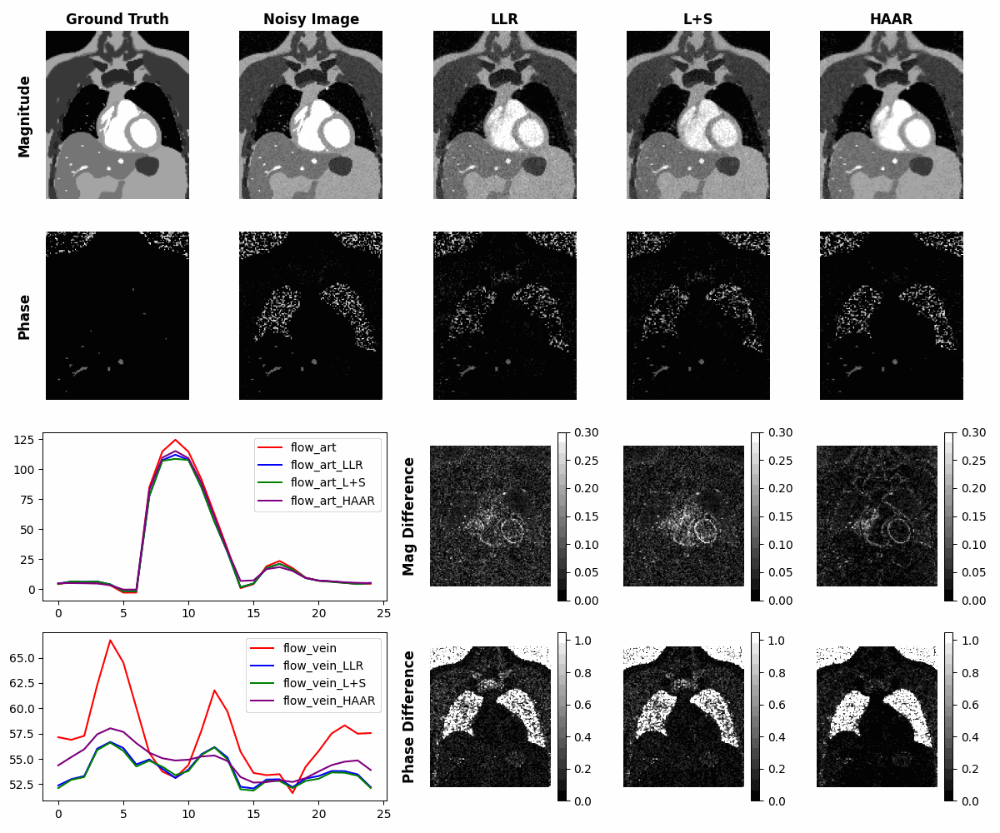

# MRI_TorchRecon
Including 4D l1 wavelet, low-rank and low-rank plus sparse reconstruction algorithm for MRI implemented by PyTorch

## Requirements
- Python 3.x
- PyTorch 
- NumPy
- argparse
- tqdm
- matplotlib
- imageio

## Usage


```bash
python examply.py
```



The data used in the ***example.py*** can be found at https://drive.google.com/file/d/1rW7qOMtbE_gAKuDOX9I-34vXon8XHwv1/view?usp=sharing. 


## Reference
https://github.com/mrirecon/bart

https://gregongie.github.io/files/misc/ongie-lrmc-julia.html

https://web.eecs.umich.edu/~fessler/course/598/l/n-05-prox.pdf

https://codeocean.com/capsule/0115983/tree/v1

https://github.com/jinh0park/pytorch-ssim-3D

https://ieeexplore.ieee.org/document/8540024